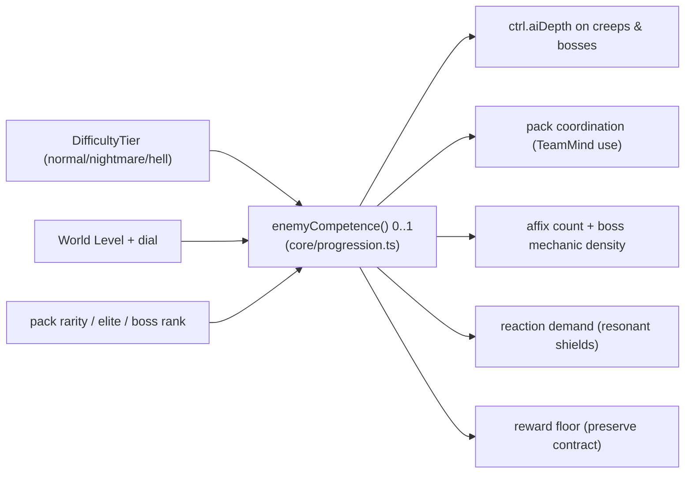

# COMBAT DEPTH OVERHAUL — harder means smarter, not tankier

**Goal:** make ANCIENTS' real-time PvE battles (overworld camps/elites,
echoes/recruit duels, dungeons, raids, regional bosses) more *interesting* and
*challenging* — especially at high difficulty and late game — by making "harder"
mean **smarter + more demanding**, not tankier. **Success looks like:** at
hell / high World Level a coordinated, mechanic-rich, reaction-demanding pack
beats a careless player *even after we cut its raw HP/damage*, provable by new
headless guards (a competence dial that is a real, separate lever from stats, a
"reaction-required" wall, a playable TTK band on the trimmed curve, and a
normal+WL0 reversibility floor). **Non-goals:** the macro autobattler / Captains
draft (out of scope — gyms/Elite Five stay pure macro Dota); `src/core/` stays
headless and deterministic (`boundary.test.ts` stays green); every change rides
tuning + an opt-out so it is reversible.

Companion to `SPEC.md` (§6 Micro Combat), `DECISIONS.md`, `PROGRESSION_OVERHAUL.md`
(the World-Level danger/reward dial this builds on), `AI_OVERHAUL.md` /
`GAMBIT_AI_OVERHAUL.md` (the utility scorer, combat profiles, team-mind, and
boss phase-FSM this routes competence into), and `DUNGEON_OVERHAUL.md`.

**This is an implementation spec.** Every section names the exact files,
functions, tuning keys, and tests. The headless deterministic core
(`src/core/`) stays untouched in its resolution layer (no `three`, no DOM,
deterministic for a seed); competence/`aiDepth` are numeric core inputs
(boundary-safe), while the encounter wiring and the danger dial live in the
systems layer.

Status: **implemented in code (P0–P5).** Full focused + whole-suite gates were
green on 2026-06-15: `tsc --noEmit` clean and `vitest run` = **5765 passed
(105 files)**, including the new `combat-depth.test.ts`, plus
`combat-scaling.test.ts`, `combat-readout.test.ts`, `domains.test.ts`,
`draft-format.test.ts`, and `boundary.test.ts`. Known cleanup outside these
gates: some Playwright expectations and rerun artifacts carry stale visual/WebGL
timing failures (pre-existing, unrelated to this overhaul).

Live baselines this spec builds on: `SAVE_VERSION === 10` (`systems/game.ts`);
resonance is **always-on in the overworld/raids** and never on in macro (the
2026-06-15 resonance decision — this overhaul tunes for the resonant overworld);
creep scaling is `creepCombatScale()` in `core/unit.ts`.

---

## The spine: one "enemy competence" dial

Difficulty used to split across two disconnected systems — `DifficultyTier`
(bosses/dungeons/raids) and World Level (overworld) — and only ever moved stats
plus a little boss AI. We unify the *challenge* signal into one derived scalar
and route it to four outputs.



`enemyCompetence(opts)` (`core/progression.ts`) returns 0..1 from tier +
worldLevel + rarity/rank:

```
base   = bossTierAiDepth[tier]   // normal 0.45 / nightmare 0.7 / hell 1.0
       + worldLevel * 0.045      // featured WL, cap 8 -> +0.36
       + rarity                  // champion +0.08 / rare +0.16
       + rank                    // elite +0.06 / boss +0.10
clamped to [0,1]
```

It **reuses the `bossTierAiDepth` band as the tier floor**, so `normal + WL0`
equals `ai.depthRefAiDepth` (0.45) — exactly today's depth baseline, where
`aiDepthBonus` is 0 (reversibility) — and ramps hard into hell / high WL / rare
packs / bosses. All knobs live in `TUNING.competence` (`data/tuning.ts`):
`perWorldLevel 0.045`, `championBonus 0.08`, `rareBonus 0.16`, `eliteBonus 0.06`,
`bossBonus 0.10`, plus the three gates `packCoordMinDepth 0.62`,
`comboMinDepth 0.7`, `reactionDemandMinDepth 0.55`.

## Pillar A — smarter enemies (close the creep AI gap)

- **Creeps get an AI depth.** `Sim.spawnCreep` accepts an `aiDepth` and stamps
  `u.ctrl.aiDepth` on non-owner creeps, so the already-built depth-scaled
  behaviors (`aiDepthBonus` in `core/utility.ts`: mana discipline, combo
  follow-through, hold discipline) finally reach camps and dungeon packs. The
  systems layer feeds it through `Game.combatDepthFor(opts)`
  (`systems/game.ts`), which returns `enemyCompetence(opts)` — or `undefined`
  when the opt-out is set. The boss split the audit found (boss had
  `ctrl.boss.depth` but not `ctrl.aiDepth`) is unified in `core/macro.ts` and
  the live boss spawn.
- **Kit-true creep profiles.** The `generalist` fallback in `rolesOf()` is
  replaced by `creepRolesOf(creepId)` (`core/combat-profile.ts`), which infers
  roles directly from the creep's kit by scanning its abilities'
  effects/targets/statuses (`scanCreepEffects` → `CreepKit` →
  `deriveCreepRoles`): summon → pusher, ally heal/shield → support, ranged
  nuke → nuker/carry, hard CC → initiator/disabler, durable brute → durable.
  Results are cached per creep id. This is the cheapest "each species plays
  differently" win, and it makes the shared utility scorer weight each creep
  correctly.
- **Pack coordination at depth.** `thinkCreep` (`core/controllers.ts`) routes a
  pack whose `aiDepth ≥ competence.packCoordMinDepth` (0.62) through the new
  `thinkCreepPack`, so an elite / high-competence camp consumes
  `sim.teamMind(team)` like a raid party: shared **focus-fire** (the team's
  target, while it stays inside the camp's leash so the pack never abandons its
  ground), **spread** for backline casters out of stacked area damage
  (`spreadSpacingOrder`), and **peel** by a frontline body onto whoever is
  diving a softer packmate (`packPeelOrder`). Single-unit cross-ability combos
  open to high-depth creeps via `canUnitCombo` (`core/utility.ts`), gated at
  `competence.comboMinDepth` (0.7). The kit-true scorer still picks the actual
  ability; coordination only shapes focus + spacing.

## Pillar B — richer mechanics (and spread them everywhere)

- **Reaction demand + legibility.** Resonance is always-on in the overworld
  (`systems/game.ts`) and forced on in dungeons (`systems/dungeon-session.ts`)
  and raids/domains (`core/macro.ts`), so a shielded elite genuinely requires
  its weakness element — a stronger state than the plan's "drive from
  competence," and the reason `reactionDemandMinDepth` remains a *reserved*
  calibration knob rather than a live gate (resonance is universal, not gated).
  For legibility, `CombatReadout.shields` (`systems/game.ts`) surfaces each
  shielded enemy's element, `weakTo` list, shield HP%, and a `vulnerable` flag;
  `renderCombatReadout` (`ui/hud.ts`, styled in `ui/styles.css` as `.shield-line`
  / `.shield` / `.shield.broken`) names the weakness so the player knows which
  element to bring. Guarded by `combat-readout.test.ts`.
- **Overworld bosses run mechanics.** Regional bosses used to auto-resolve and
  never fire their authored `BossDef.phases`. `runBossFight` (`systems/game.ts`)
  now routes through `runBossBattle` (`core/macro.ts`), which wraps
  `createRaidMechanicRunner` with the boss's `phases`: each phase fires its
  `onEnter` effects **immediately** on crossing its HP threshold (self-empowers
  must not be held behind the raid FSM's cadence gating). A **soft-enrage** timer
  (`TUNING.regionalBossSoftEnrageSec = 90`) arms the boss controller on the same
  clock so you cannot out-sustain a long fight. Dungeon guardians already ran
  phases, so the runner avoids double-firing.
- **Expanded + spread affixes.** Five new `AffixDef`s in
  `data/dungeon-affixes.ts` use the existing effect vocabulary: `summoner`
  (spawns thralls at engage, hell), `volatile` (periodically-detonating
  follow-zone, nightmare), `reflective` (tight thorns follow-zone, nightmare),
  `hexer` (purge+silence `onEnter` zone, hell), and `warding` (stationary damage
  zone at engage, nightmare). They are appended to every dungeon `affixPool` /
  `affixes` in `data/dungeons.ts` and gated by `minTier`. At nightmare+ the
  overworld camp loop (`spawnCampCreeps`, `systems/game.ts`) also affixes
  **past the elite lead**: a single light pack affix from
  `OVERWORLD_PACK_SPREAD_AFFIXES` (`['fast','molten','warding','reflective']`)
  is applied to non-lead elites via `applyOverworldAffix`, off a dedicated
  deterministic `Rng` so the world stays seed-stable.

## Pillar C — better curve (mechanics over sponge, plus an overworld dial)

- **Cut the sponge, reinvest in competence.** The HP/damage growth that
  dominated late game is trimmed in `data/tuning.ts`: `creepCombatScale.tier`
  (nightmare 1.5 → **1.4**, hell 2.1 → **1.85**), `bossTierScale` (hell HP
  2.45 → **2.05**, hell damage 1.65 → **1.5**), and `worldLevel.hpPerLevel`
  (0.08 → **0.06**). `normal` and WL0 numbers are left untouched, so early game
  and the reversibility floor are unchanged; the lost durability is paid back as
  competence (smarter AI, coordination, mechanics). `combat-scaling.test.ts`'s
  sponge guard was retightened to the new ceiling.
- **An overworld danger dial.** The overworld only had World Level. The
  player-chosen `worldLevelTier` ascension dial (already gated by badges /
  Trainer Level) now maps to a `DifficultyTier` via
  `Game.overworldActivityTier()` (dial ≥ 3 → hell, ≥ 1 → nightmare, else
  normal), wired into the gym and Elite difficulty fallbacks
  (`difficulty[...]?.tier ?? overworldActivityTier()`). Turning danger up raises
  **competence + reward**, not just shield HP. Dial 0 maps to `normal`, so
  default difficulty and existing tests are unchanged.
- **Keep the reward contract honest.** The overworld kill-credit path
  (`handleKillCredit`) had hardcoded `'normal'` into the bounty scale; it now
  reads `creepCombatTier(region)` so a nightmare/hell region pays its tier. The
  World-Level reward keys (`rewardPerLevel`, grade-floor) already scale with the
  dial from `PROGRESSION_OVERHAUL §9`.

## Cross-cutting

- **Recruit / echo.** Overworld echoes already used gambit AI; they now receive
  `enemyCompetence` depth (`spawnEchoHero` → `EchoOptions.aiDepth`,
  `core/echo-unit.ts`). Bind duels were upgraded from the dumb creep controller
  to a **gambit** controller (`buildDefaultGambit(def.roles)`) with competence
  `aiDepth` (`Game.startBindDuel`), so a recruit fight plays its kit.
- **Reversibility / opt-out.** `settings.combatDepth` (default `true`, in
  `GameSave['settings']`) flows through `combatDepthFor`: when `false`, creeps
  get `undefined` aiDepth and the competence escalation is off, reproducing
  today's behavior. No save migration was needed (additive optional field;
  `SAVE_VERSION` stays 10). The `combatDepth: true` default is set in the
  constructor, the class field, and `newGameSave`.
- **Boundary / determinism.** `enemyCompetence`/`aiDepth` are pure numeric core
  inputs; coordination reads `sim.teamMind` and the deterministic `sim.rng`; the
  resonance-on state and the dial live in the systems layer. `boundary.test.ts`
  stays green.

## Guards (P5)

`src/test/combat-depth.test.ts` encodes the overhaul's thesis as headless
invariants:

- **Smarter, not tankier (structural).** In a mirrored item-less 3v3, competence
  is carried on the controller (`ctrl.aiDepth` = hell vs ref) with **identical
  stats**, proving depth is a real lever that is *separate* from stats; a second
  case shows a stat multiplier moves HP/damage while competence does not (the two
  dials are orthogonal); a third shows a boss setup carries hell competence
  independently from its HP/damage columns. (We deliberately assert the dial's
  structure rather than a flaky win-rate head-to-head: in an isolated hero mirror
  the depth *scalar* alone is a smaller swing than raw stats — the real
  competence teeth are pack coordination, mechanics, and the reaction wall, which
  apply to creep packs/bosses, not a gambit mirror.)
- **Reaction required.** With resonance on, the weakness element melts an
  elemental shield ~`weakMult`× faster than an off-element hit (the off-element
  hit cannot break it); with resonance off, even the weakness element gets no
  discount (the opt-out floor).
- **Playable TTK band.** A geared party clears a hell regional boss through its
  phases + soft-enrage inside a demanding-but-winnable window on the trimmed
  curve (a kill, but a fight).
- **Reversibility.** `enemyCompetence({tier:'normal', worldLevel:0})` equals the
  legacy depth baseline (`ai.depthRefAiDepth`) to 6 places, and ramps strictly
  upward into hell / high WL / boss rank.

## Phased delivery (as shipped, green per slice)

| Phase | Slice | Status |
|-------|-------|--------|
| P0 | Competence core + creep `aiDepth` + kit-true creep profiles | done |
| P1 | Pack coordination (focus-fire / spread / peel + combos at depth) | done |
| P1 | Recruit/echo competence; bind duels use gambit AI | done |
| P2 | Reaction demand (resonant shields) + HUD weakness legibility | done |
| P3 | Overworld boss mechanics + phases + soft-enrage | done |
| P3 | Affix expansion (5 new) + spread past the elite lead, `minTier`-gated | done |
| P4 | Curve rebalance (cut sponge) + overworld danger dial + bounty-tier fix | done |
| P5 | Guards (`combat-depth.test.ts`) + this doc + DECISIONS rows | done |

## Risks (and how they're held)

- **Smarter AI feels unfair / spiky** — coordination and combos are gated behind
  competence thresholds (`packCoordMinDepth` / `comboMinDepth`); the
  leash/heal-reset escape hatch is intact; the `combatDepth` opt-out and the
  player-chosen dial are the safety valves.
- **Always-on resonance changes balance broadly** — this is the canonical balance
  target per the 2026-06-15 resonance decision; the "reaction-required vs
  trivial" guard pins the intended behavior.
- **Curve rebalance regresses early game / reward pacing** — `normal` and WL0
  values are unchanged; `combat-scaling.test.ts` guards the sponge ceiling and
  the texture-over-HP invariant; the bounty-tier fix keeps reward honest.
- **Determinism** — all new competence/coordination is seed-stable in
  `src/core/`; `boundary.test.ts` and the headless suite stay green.
