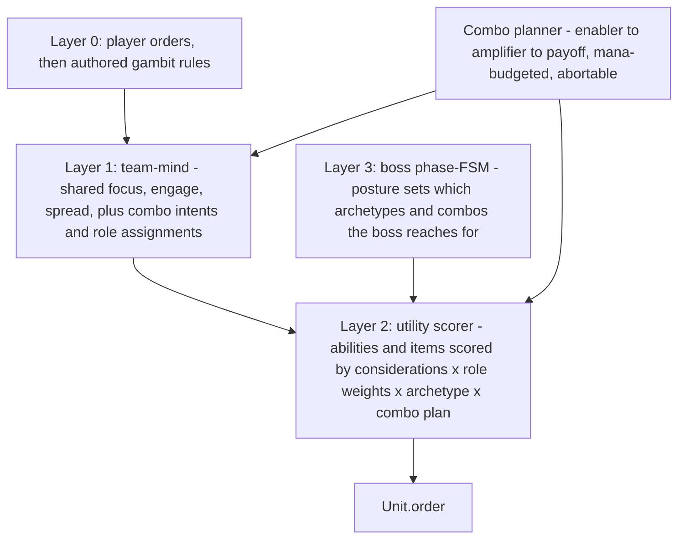

# GAMBIT AI OVERHAUL — roles that play their items, and items that play together

How the brain stops using items one at a time and starts using them the way a person does: the right tool, in the right order, set up by the rest of the kit. Companion to `AI_OVERHAUL.md` (the layered brain, combat profiles, threat, boss FSM), `SWAP_COMBAT_OVERHAUL.md` (elements, reactions, tag-swap setup and payoff), `ITEM_REHAUL.md` (the catalog), and `SPEC.md` §7 (the gambit grammar).

Same footing as the rest of the project. The headless deterministic core (`src/core/`) stays the system of record. It never imports `three`, never touches the DOM, and replays identically for a seed. This work is additive, data-driven, and reversible. `boundary.test.ts` stays green, `npm test` and `npm run build` stay green, and the headless auto-resolve paths stay the balance reference.

---

## 0. WHERE THIS PICKS UP

`AI_OVERHAUL.md` shipped the layered brain. Player orders and authored gambit rules win first (Layer 0), a team-mind picks one shared focus and an engage state (Layer 1), a utility scorer turns an open move into an action (Layer 2), and a boss phase machine sets posture (Layer 3). One scorer serves creeps, gambit heroes, and the boss. A hero already fights like its role because `combat-profile.ts` reads its role, attribute, range, and kit into seven weights the scorer multiplies through.

Three things are thin, and they are exactly the part that makes items feel smart.

1. **Items are scored one at a time, greedily.** `chooseUtilityOrder` walks each slot, scores every ability and item on its own, and emits the single highest-scoring order for the tick. Nothing reasons about a second item or a sequence.

2. **Five items have real considers; the rest fall back to a generic classifier.** `scoreItemActive` hand-tunes Black King Bar, Force Staff, Glimmer Cape, Mekansm, and Eul's. Everything else routes through `scoreItemByIntent`, which reads effect tags and fires on a sane but blunt heuristic. Blink, Veil of Discord, Rod of Atos, Orchid, Bloodthorn, Scythe of Vyse, Shiva's, Crimson Guard, Pipe, Nullifier, Dagon, Ethereal Blade, Abyssal, Aeon Disk, Lotus, Linken's, Solar Crest, and Medallion all miss their signature timing.

3. **Setup and payoff exist, but only within one unit's ability list, and only after the fact.** `comboAdjustedScore` rewards an ability cast after a named enabler inside a window (`HeroDef.combo`, `TUNING.ai.comboWindowSec`, `comboWeight`). The element and tag-swap systems leave a live setup that `combo-setup-active` can read. None of this plans ahead, none of it includes items, and none of it coordinates across two heroes.

The upgrade is three moves on top of the existing model: classify items into archetypes the scorer understands, give each role a short item playbook, and add a planner that sequences an enabler into a payoff. Cross-unit coordination falls out of the same planner once it lives on the team-mind.

---

## 1. THE MODEL — the same layers, with item sense added

Keep the four layers. Add an item-archetype tag the scorer reads, a per-role item playbook that biases which archetype to reach for, and a small combo planner that the team-mind and the per-unit scorer both consult. The planner is the new idea; everything else is data the existing scorer already knows how to multiply.



The planner is a pure function of sim state, like the rest. It reads positions, health, cooldowns, mana, statuses, element auras, and the threat table, and returns a ranked set of combo intents. Each intent is a typed chain of steps with a target and a window. The scorer raises the score of the next step in an active intent and refuses to spend an enabler when its payoff is not ready. Variety on the boss side keeps coming from `sim.rng.fork()`, so a replay of a seed is identical.

Authored intent still wins. A fired gambit rule decides the action. The planner and the archetype weights only shape the open move, which is the same suppression boundary `AI_OVERHAUL.md` settled.

---

## 2. ITEM ARCHETYPES — a vocabulary the scorer can plan with

Today `intentOf` classifies an active by raw effect flags (`offensive`, `hardControl`, `escape`, `affectsAlly`, and so on). That is enough to fire an item in isolation. It is not enough to know that Blink opens a fight, Veil makes the next nuke land harder, or Glimmer is the team's one save.

Add a derived `ItemArchetype` next to the existing flags, computed once from the active's effects (the same way `combatProfile` derives from role tags). The archetype is the noun the playbook and the planner speak.

| Archetype | What it does | Items in the catalog |
|---|---|---|
| `initiation` | closes the gap to start a fight | Blink Dagger, Boots of Travel, Breacher Cloak (swap-in) |
| `immunity` | shrugs or blocks incoming control | Black King Bar, Aeon Disk, Linken's Sphere, Lotus Orb |
| `lockdown` | hard or soft control on a target | Scythe of Vyse, Abyssal, Rod of Atos, Gleipnir, Orchid, Bloodthorn, Eul's, Meteor Hammer, Heaven's Halberd, Nullifier |
| `amplify` | makes a target take more damage | Veil of Discord, Ethereal Blade, Orchid/Bloodthorn break, Medallion, Solar Crest, Desolator (passive) |
| `nuke` | direct burst damage | Dagon, Ethereal Blast, Shiva's, Gleipnir, Hand of Midas (execute) |
| `save` | protects one ally | Glimmer Cape, Force Staff (ally), Lotus Echo Shell, Linken's transfer, Wind Waker, Ghost Scepter (self) |
| `sustain` | heals or shields the group | Mekansm, Guardian Greaves, Holy Locket, Crimson Guard, Pipe, Satanic, Bloodstone |
| `escape` | repositions the caster out of danger | Force Staff (self), Eul's (self), Manta, Silver Edge, Blink |
| `field` | a standing aura or zone that shapes spacing | Shiva's slow aura, Radiance burn, Vladmir's, Assault Cuirass, Crimson, Pipe |
| `cleanse` | removes debuffs from an ally or buffs from an enemy | Guardian Greaves, Manta, Lotus, Nullifier (enemy) |

An item can carry more than one archetype. Force Staff is both `save` and `escape`. Bloodthorn is `lockdown` and `amplify`. The planner reads the set, not a single label.

This stays inside the closed-vocabulary rule from `COMBAT_OVERHAUL.md` §3.2. A new item gets behavior by classifying into archetypes, not by a bespoke consider. The five hand-tuned considers stay as overrides for the cases where the generic path is too coarse, and over time most of them fold into archetype logic.

---

## 3. ROLE PLAYBOOKS — each role reaches for different tools

A role already has weights. Give it a short, ordered list of the archetypes it prefers when an opening exists, and the role at which it tends to aim them. This is the role-by-item matrix, expressed as data the scorer biases with, not a script.

| Role | Reaches for first | Reads like |
|---|---|---|
| `initiator` | `initiation` then `lockdown`, holds `immunity` for after the jump | Blink onto the cluster, then chain stun, then BKB if the reply is loaded |
| `nuker` | `amplify` then `nuke` on the most dangerous target | Veil the target, then Dagon, then finish with the kit |
| `disabler` | `lockdown` on the focus the team is converging on | Atos or Scythe the carry the rest of the team is about to burst |
| `carry` | `immunity` and `sustain` to stay alive while it deals damage, `escape` low | BKB through the chain, Satanic in the brawl, Manta the moment it is caught |
| `support` | `save` for the diving target, `sustain` for the group, `lockdown` to set up the burst | Glimmer the dived carry, Mek the wounded stack, Atos the enemy initiator |
| `durable` | `field` and `sustain` while fronting, `lockdown` on the dive | Crimson on engage, Pipe before the area nuke, Abyssal the diver |
| `pusher` | `nuke` and `field` for waves and clusters | drop the area, pull the group through it |
| `escape` | `escape` early to survive, `lockdown` opportunistically | Force or Eul out, then re-enter on its terms |
| `generalist` | the existing balanced weights, no special reach | the current behavior |

The playbook is a bias, not a gate. A nuker still saves an ally if the save score is highest. The playbook tilts the scan so the role leads with the tool that matches its job, the same way a nuker already leads with its burst instead of its first-listed spell.

Attribute keeps its lean from `combat-profile.ts`. A strength durable values `field` and `sustain` a touch more, an intelligence nuker values `amplify` and `nuke` more, an agility carry values `escape` and `immunity` more. These add to the role bias rather than replacing it.

---

## 4. THE COMBO PLANNER — enabler, amplifier, payoff

This is the heart of the upgrade. A combo is a typed chain of steps, each a cast or an item use with a target mode and a window. The planner builds candidate chains from what a unit (or a team) can do right now, scores the chain by its payoff, and feeds the next step back into the scorer with a raised score. It also enforces the discipline a person has: do not spend the enabler if the payoff cannot follow.

A chain step is one of three roles:

- **Enabler.** Creates the opening. `initiation` (Blink in), `lockdown` (root or hex the target), or a tag-swap or element setup the `SWAP_COMBAT_OVERHAUL` systems already track.
- **Amplifier.** Increases the payoff. `amplify` items, an element aura that a reaction will cash in, or a control that holds the target still long enough.
- **Payoff.** Cashes the opening. The big `nuke`, the burst rotation, or focused attacks from the whole team.

### Worked chains, all from the current catalog

- **Initiator dive.** Blink Dagger (enabler) into the cluster, hard stun (enabler), Black King Bar (immunity) only if the enemy reply is loaded, then the ult (payoff). The planner refuses BKB before the blink, because the blink is the step that needs to land first.
- **Caster burst.** Veil of Discord (amplify) on the target, Dagon (nuke), then the kit. Or Ethereal Blade (amplify and lockdown by disarm) into the nuke. The planner will not Dagon through full magic resist when a Veil is up and ready.
- **Lockdown to kill.** Rod of Atos root (enabler) or Scythe of Vyse hex (enabler) on the focus, then the team's burst (payoff). This is the chain that most wants to be cross-unit (section 5).
- **Silence-burst.** Orchid or Bloodthorn (lockdown and amplify) on a caster, then focus fire while it cannot answer.
- **Support save chain.** Force Staff (save) the dived ally out of the crush, then Glimmer (save) to break the chase. Two saves, sequenced, not fired on the same tick.

### Scoring, mana, and abort

- The chain's score is the payoff's value, multiplied by the existing combo weight and discounted by the steps it costs. Reuse `comboAdjustedScore` and `TUNING.ai.comboWindowSec` / `comboWeight`; the new part is letting an item be a node and letting the planner look one step ahead rather than only rewarding the follow-up after the fact.
- **Mana budget.** Before committing to a chain, the planner checks the unit can pay for the steps it will spend itself within the window. This extends the current `manaFloorPct` and `manaConservationWeight` from a per-cast check to a per-plan check, so a hero does not Blink in and then sit manaless.
- **Abort.** A chain drops if the target dies, leaves range, gains immunity, or the window lapses. The enabler is never spent on a dead plan. This is what stops the classic waste of a Blink or a BKB on nothing.
- **Depth.** Deeper AI commits to longer and tighter chains, reusing `aiDepthBonus` and `depthDisciplineGain`. A normal-tier raid plays two-step combos; hell-tier sets up the full enabler-amplifier-payoff and holds the enabler for the right moment.

---

## 5. CROSS-UNIT COORDINATION — the team shares the plan

Put the planner's output on the team-mind, computed on the existing `teamFocusReassessTicks` cadence, and the matrix becomes a team behavior instead of five solo ones. The team-mind already holds the shared focus and the engage state. Add three things.

- **Role assignments.** One save-holder, one primary initiator, one lockdown source per shared focus. This stops two supports Glimmering the same ally on the same tick and stops two initiators blowing two Blinks on the same jump. Assignments are deterministic, broken by uid.
- **Cross-unit chains.** A `lockdown` from the disabler and a `nuke` from the nuker, aimed at the same shared focus, is one chain the team-mind sequences: the disabler's Atos becomes the enabler, the nuker's Dagon becomes the payoff, and the nuker holds the nuke until the root lands. This is the wombo the engage state already gestures at, now expressed as item nodes.
- **Field awareness.** `field` items shape spacing. Allies prefer to stand in a friendly Mek, Pipe, Crimson, or Vladmir's radius, and prefer to pull the enemy focus into a Shiva's or Radiance field. This reuses the spread and stack machinery from `AI_OVERHAUL.md` §6, keyed off aura radii instead of only telegraphs.

The boss reads the same planner through Layer 3. Its posture picks which archetypes and chains it reaches for: hold the area `nuke` for a cluster in the opening, `lockdown` and burst a reachable healer under pressure, pop `immunity` or `escape` when a clutch chain is landing, ramp `field` and offense in enrage. The autobattler and the Elite Five field the upgraded planner on both sides, fixed and symmetric, so competitive feel stays clean and the depth lever stays out of the gym layer.

---

## 6. ARCHITECTURE — what touches what

Core modules, all headless and deterministic:

- `src/core/combat-profile.ts` gains the per-role item playbook (the preferred archetype order and target lean), derived and cached alongside the existing weights.
- `src/core/item-archetype.ts` (new) derives the `ItemArchetype` set from an active's effects, the parallel to `combatProfile` for items. Cached by item def id.
- `src/core/combo-planner.ts` (new) builds, scores, mana-budgets, and aborts chains, and exposes the per-unit and per-team intents. Pure functions over sim state.
- `src/core/utility.ts` reads archetypes and the active chain in `scoreAbility`, `scoreItemActive`, and `scoreItemByIntent`, and folds the planner's next-step bonus into the existing combo multiplier. The five hand-tuned considers stay as overrides.
- `src/core/sim.ts` stores the planner output on `TeamMind` and recomputes it on the existing cadence.
- `src/core/boss-brain.ts` maps each posture to the archetypes and chains it reaches for.
- `src/data/tuning.ts` carries the new knobs (archetype weights per role, chain step discount, plan-level mana margin, cross-unit assignment limits) beside the existing `ai.itemScore`, `comboWindowSec`, and `comboWeight`, so a balance pass stays a data edit.

`src/core/controllers.ts` stays the orchestrator. `thinkGambit` and `thinkBoss` acquire focus, honor authored actions, then call the scorer, which now consults the planner where the move is open. `src/core/types.ts` carries the archetype type and any new combo-aware gambit conditions. No `GameSave` change is needed: archetypes are derived, playbooks are data, and saved gambits keep loading.

The gambit editor in `src/ui/hud.ts` can expose the new reads as conditions, grouped by category like the rest: `combo-ready` (an enabler is up and a payoff is in range), `save-assigned` (this unit is the team's save-holder), `in-friendly-field` and `enemy-in-hostile-field`. These let an author write the same intent the planner runs automatically.

---

## 7. PHASING — three phases, each shippable on its own

Three phases, in dependency order: the vocabulary, then the single-unit planner that uses it, then the team that shares the plan. Each phase lifts behavior on its own and ships green, so the work can stop after any phase and still be a win. Every phase holds the same gate: `npm test` and `npm run build` green, `boundary.test.ts` green, determinism preserved, and the headless paths as the balance reference.

### Phase 1 — item archetypes and role playbooks

The vocabulary, and the role bias that uses it. No planner yet. This phase alone makes every item fire on archetype-true timing and makes each role lead with the right tool.

New and changed code:

- `src/core/item-archetype.ts` (new). Derives the archetype set from an active's effects, cached by item def id.

```ts
export type ItemArchetype =
  | 'initiation' | 'immunity' | 'lockdown' | 'amplify' | 'nuke'
  | 'save' | 'sustain' | 'escape' | 'field' | 'cleanse';

// pure, deterministic, cached by ItemDef.id
export function itemArchetypes(def: ItemDef): Set<ItemArchetype>;
```

- `src/core/combat-profile.ts`. Add the per-role playbook to `CombatProfile`: the ordered archetypes the role reaches for and the role it tends to aim them at. Derived from the same role tags and attribute lean already in `derive()`.

```ts
export interface ItemPlaybook {
  reach: ItemArchetype[];          // preferred order when an opening exists
  aimAt?: CombatRole;              // e.g. disabler aims lockdown at the enemy carry
}
// CombatProfile gains: playbook: ItemPlaybook;
```

- `src/core/utility.ts`. `scoreItemActive` and `scoreItemByIntent` read the archetype set and apply the playbook bias to the score. The five hand-tuned considers stay as overrides.
- `src/data/tuning.ts`. Add `ai.archetypeWeight` (per-role, per-archetype multipliers) beside `ai.itemScore`.

Tests (`src/test/item-archetype.test.ts`, extend `utility-ai.test.ts`): every catalog active classifies into at least one archetype; the five hand-tuned items keep their current behavior; a nuker leads with amplify-then-nuke and a support leads with save-then-sustain across a seed sweep.

### Phase 2 — the single-unit combo planner

The sequencing engine, on one unit. Enabler to amplifier to payoff, mana-budgeted, abortable. This is where the AI stops wasting openers.

New and changed code:

- `src/core/combo-planner.ts` (new). Builds candidate chains from a unit's ready abilities and items, scores each by payoff, checks the unit can pay for its own steps in the window, and returns the best chain plus the next step to take now.

```ts
export interface ComboStep {
  kind: 'cast' | 'item';
  slot: number;
  role: 'enabler' | 'amplifier' | 'payoff';
  targetMode: GambitTargetMode;
  windowSec: number;
}
export interface ComboPlan {
  steps: ComboStep[];
  targetUid: number;
  score: number;
  nextStep: ComboStep;     // the order to raise this tick
}
// pure over sim state; null when no chain beats a plain action
export function planUnitCombo(sim: Sim, u: Unit, focus: Unit): ComboPlan | null;
```

- `src/core/utility.ts`. `chooseUtilityOrder` consults `planUnitCombo` before the greedy slot scan and folds the next step into the existing combo multiplier (`comboAdjustedScore`, `comboWindowSec`, `comboWeight`). The planner refuses to spend an enabler when its payoff is not ready, and aborts on target death, range loss, immunity, or window lapse. Mana budgeting extends `manaFloorPct` and `manaConservationWeight` from per-cast to per-plan. Depth scales chain length and enabler patience through `aiDepthBonus` and `depthDisciplineGain`.
- `src/data/tuning.ts`. Add `ai.combo.stepDiscount`, `ai.combo.planManaMargin`, and depth scaling for chain length.

Tests (`src/test/combo-planner.test.ts`): a hero with Blink and Black King Bar blinks first and never pops BKB on a dead plan; a caster casts Veil before Dagon and never Dagons through full magic resist with a Veil ready; a chain aborts cleanly when the target dies mid-window; identical seeds replay identical plans.

### Phase 3 — cross-unit coordination, boss, and depth

The planner moves onto the team-mind so five heroes share one plan, and the boss reads the same machinery through its posture.

New and changed code:

- `src/core/combo-planner.ts`. Add `planTeamCombos(sim, team)`: role assignments (one save-holder, one primary initiator, one lockdown source per shared focus, broken by uid), cross-unit chains (the disabler's lockdown is the enabler, the nuker's nuke is the payoff, aimed at the shared focus), and field awareness keyed off aura radii.
- `src/core/sim.ts`. Store the team plan on `TeamMind`, recomputed on `teamFocusReassessTicks`.

```ts
// TeamMind gains:
//   saveHolderUid: number | null;
//   initiatorUid: number | null;
//   chains: ComboPlan[];        // cross-unit, indexed by participant
```

- `src/core/utility.ts` raid considerations. Reuse the spread and stack machinery from `AI_OVERHAUL.md` §6 for field awareness: prefer friendly Mek/Pipe/Crimson/Vladmir radius, pull the enemy focus into Shiva's or Radiance.
- `src/core/boss-brain.ts`. Map each posture to the archetypes and chains it reaches for: hold the area nuke for a cluster in the opening, lockdown-and-burst a reachable healer under pressure, pop immunity or escape when a clutch chain lands, ramp field and offense in enrage.
- `src/ui/hud.ts` (optional). Expose `combo-ready`, `save-assigned`, `in-friendly-field`, and `enemy-in-hostile-field` as authorable gambit conditions, grouped by category.

Tests (extend `raid-ai.test.ts`, `boss-brain.test.ts`): two supports never double-save the same ally on a tick; a disabler's root precedes the nuker's burst on the shared focus; live versus headless raid agreement holds; higher tiers measurably tighten combos while staying deterministic.

---

## 8. SETTLED DECISIONS AND OPEN QUESTIONS

Settled, carried from `AI_OVERHAUL.md`:

1. **Authored intent wins.** A fired gambit rule decides the action. The planner and archetype weights only fill the open move.
2. **Closed vocabulary.** New items get behavior by classifying into archetypes, not by bespoke scripts. A behavior that seems to need a script gets redesigned as an archetype plus a weight.
3. **Determinism.** The planner is a pure function of sim state. Boss variety stays seeded from `sim.rng.fork()`. Ties break by uid.
4. **Additive and reversible.** Auto-resolve stays. The five hand-tuned considers stay until archetype logic clearly covers them. The base game is never worse for this existing.

Open, to settle during Phase 2 and Phase 3:

- **Plan persistence.** Does a committed chain live on the unit across think ticks, or is it rebuilt each decision tick from scratch? Rebuilding is simpler and more deterministic; persistence holds intent better through a noisy fight. Lean rebuild, with the enabler-spent state as the only memory.
- **Cross-unit authority.** Does the team-mind assign chains, or do units volunteer and the team-mind resolve conflicts? Lean assignment, for determinism.
- **Editor surface.** How much of the planner to expose as gambit conditions versus leave automatic. Lean to a small set of high-value reads, with the planner as the default.

---

## 9. PRINCIPLES

- **Character comes from data.** A role plays its items because of its weights, playbook, and the archetypes its kit carries. No per-hero item AI.
- **One brain, many drivers.** Creeps, gambit heroes, and the boss share the scorer and the planner. Gyms and raids inherit them through the engines they already share.
- **Plan one step ahead, not ten.** The planner sequences an enabler into a payoff and budgets the mana for it. It does not search a deep tree. Cheap, legible, deterministic.
- **Never waste the enabler.** The discipline that reads as competence is refusing to spend the opener on a dead plan.
- **Keep the core headless and deterministic.** Every layer is a pure function of sim state, with seeded randomness only where variety is wanted. `boundary.test.ts` stays green.
- **Ship in three phases.** Phase 1 lifts every fight on its own. Each later phase stands alone and stays green.
